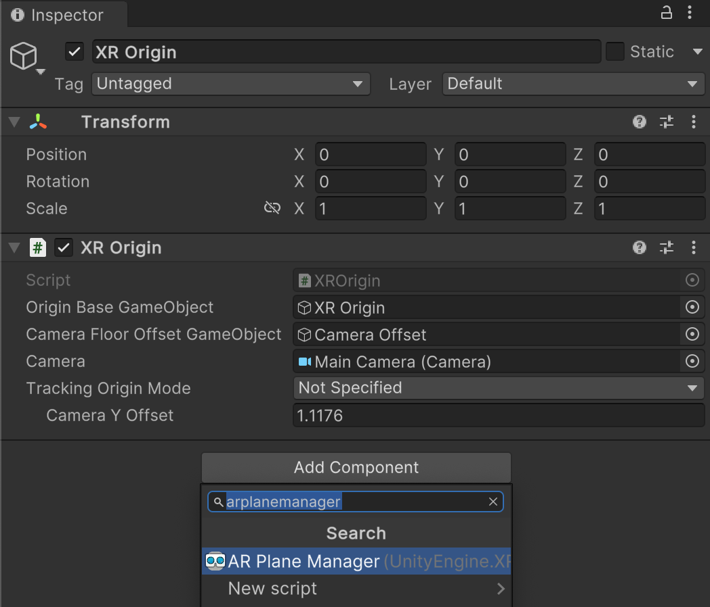
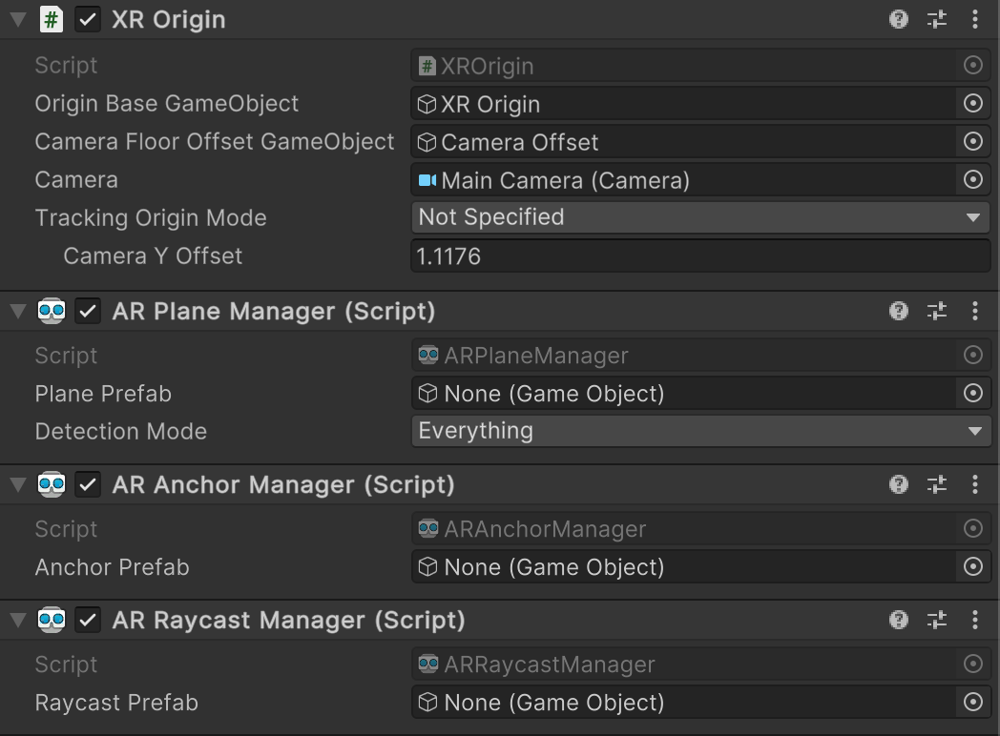

# Managers

In AR Foundation, a *manager* is a component that provides a scripting interface for an AR feature in a scene. For example, the [plane manager](xref:arfoundation-plane-detection) enables plane detection functionality and allows you to respond to detected planes in your application code.

<br/>*AR Plane Manager component*

AR Foundation defines its AR features using [subsystems](xref:arfoundation-subsystems). Managers make subsystem data accessible in a scene as GameObjects and components, and they also manage the subsystem life cycle. (*Manager* is a shorthand for `SubsystemLifecycleManager`). For example, when the [XRPlaneSubsystem](xref:UnityEngine.XR.ARSubsystems.XRPlaneSubsystem) detects a plane in the environment, the plane manager creates a GameObject representing that plane. Enabling or disabling the plane manager will also enable or disable plane detection in your app, respectively.

Every AR-related subsystem has a corresponding manager. Subsystems in this package follow the naming convention **XR&lt;Feature&gt;Subsystem**, and their managers, with the exception of the [ARSession](xref:UnityEngine.XR.ARFoundation.ARSession) component, are named **AR&lt;Feature&gt;Manager**.

## Adding a manager to your scene

To add a manager to your scene, follow the same steps as you would to add any component.

> [!NOTE]
> You must add all managers in a scene to the same GameObject as the XR Origin, except the [AR Session component](xref:arfoundation-session) and [mesh manager](xref:arfoundation-meshing), which are special cases.

1. First, select the appropriate GameObject in the Hierarchy window for the manager component you intend to add.
2. Click the **Add Component** button in the Inspector.
3. Finally, search for and select the manager component you wish to add.

<br/>*Adding an AR Plane Manager component*

Managers add new trackables to a scene as children of the XR Origin, and thus define trackables' positions, rotations, and scales relative to those of the XR Origin.

<br/>*XR Origin GameObject with various managers*

## Enabling and disabling managers

You can enable or disable AR features by enabling or disabling the relevant manager. For example, you can toggle plane detection on and off by enabling or disabling the AR Plane Manager component.

You should only enable one manager of the same type in a scene at any given time. Enabling more than one instance of a manager can result in undesirable behavior, as each manager instance will interact with the same underlying subsystem.

Active AR features can cause the device to consume more power, so it is a good practice to disable managers when your app isn't using their features.

A manager responds to being enabled or disabled by calling corresponding [subsystem life cycle](xref:arfoundation-subsystems#subsystem-life-cycle) methods:

* `OnEnable`: Invokes subsystem `Start`
* `OnDisable`: Invokes subsystem `Stop`

If your [provider plug-in](xref:arfoundation-manual#required-packages) does not implement a particular subsystem, the corresponding manager automatically disables itself. For example, the [Google ARCore XR Plug-in](https://docs.unity3d.com/Packages/com.unity.xr.arcore@5.0/manual/index.html) does not currently implement the [XRObjectTrackingSubsystem](xref:UnityEngine.XR.ARSubsystems.XRObjectTrackingSubsystem), so the [ARTrackedObjectManager](xref:UnityEngine.XR.ARFoundation.ARTrackedObjectManager) always disables itself on the Android platform. See [Platform support](xref:arfoundation-manual#platform-support) or your provider documentation to confirm which subsystems are available on your target platform(s).

## Trackables and trackable managers

Many AR Foundation subsystems detect and track objects in the physical environment. These subsystems are called [tracking subsystems](xref:arfoundation-subsystems#tracking-subsystems) and their managers are called *trackable managers*. Trackable managers use data from the tracking subsystems to create and maintain trackable components and their GameObjects.

[!include[](../snippets/trackable-definition.md)]

Each type of trackable is created and maintained by a trackable manager of a matching type. A trackable manager wraps a tracking subsystem and uses its data to manage trackables and their GameObjects. For example, the [ARPlaneManager](xref:UnityEngine.XR.ARFoundation.ARPlaneManager) generates [ARPlane](xref:UnityEngine.XR.ARFoundation.ARPlane) trackables using data from the [XRPlaneSubsystem](xref:UnityEngine.XR.ARSubsystems.XRPlaneSubsystem).

This table summarizes the trackable managers and their trackable types.

| Trackable Manager | Trackable | Purpose |
| ----------------- | --------- | ------- |
| [ARPlaneManager](xref:arfoundation-plane-detection#ar-plane-manager-component) | [ARPlane](xref:UnityEngine.XR.ARFoundation.ARPlane) | Detect and track surfaces. |
| [ARTrackedImageManager](xref:arfoundation-image-tracking#ar-tracked-image-manager-component) | [ARTrackedImage](xref:UnityEngine.XR.ARFoundation.ARTrackedImage) | Detect and track 2D images. |
| [ARTrackedObjectManager](xref:arfoundation-object-tracking#ar-tracked-object-manager-component) | [ARTrackedObject](xref:UnityEngine.XR.ARFoundation.ARTrackedObject) | Detect and track 3D objects. |
| [ARFaceManager](xref:arfoundation-face-tracking#ar-face-manager-component) | [ARFace](xref:UnityEngine.XR.ARFoundation.ARFace) | Detect and track human faces. |
| [ARHumanBodyManager](xref:arfoundation-body-tracking#ar-human-body-manager-component) | [ARHumanBody](xref:UnityEngine.XR.ARFoundation.ARHumanBody) | Detect and track a human body. |
| [ARPointCloudManager](xref:arfoundation-point-clouds#ar-point-cloud-manager-component) | [ARPointCloud](xref:UnityEngine.XR.ARFoundation.ARPointCloud) | Detect and track feature points. |
| [ARRaycastManager](xref:arfoundation-raycasts#ar-raycast-manager-component) | [ARRaycast](xref:UnityEngine.XR.ARFoundation.ARRaycast) | Repeats a raycast every frame. |
| [ARAnchorManager](xref:arfoundation-anchors#ar-anchor-manager-component) | [ARAnchor](xref:UnityEngine.XR.ARFoundation.ARAnchor) | Track an arbitrary point in space. |
| [AREnvironmentProbeManager](xref:arfoundation-environment-probes#ar-environment-probe-manager-component) | [AREnvironmentProbe](xref:UnityEngine.XR.ARFoundation.AREnvironmentProbe) | Generate cubemaps of the environment. |
| [ARParticipantManager](xref:arfoundation-participant-tracking#ar-participant-manager-component) | [ARParticipant](xref:UnityEngine.XR.ARFoundation.ARParticipant) | Track other devices in a shared AR session. |

### Enumerating trackables

Trackables can be enumerated via their manager's `trackables` property. For example:

```csharp
var planeManager = GetComponent<ARPlaneManager>();
foreach (ARPlane plane in planeManager.trackables)
{
    // Do something with the ARPlane
}
```

The `trackables` property returns a `TrackableCollection`, which can be enumerated in a `foreach` statement as in the above example. You can also query for a particular trackable with the `TryGetTrackable` method.

### Trackable life cycle

A trackable's life cycle is managed by its tracking subsystem, and has three phases: added, updated, and removed. A trackable must first be added, then on subsequent frames it can be updated, removed, or have no changes. Each frame, managers query their subsystems to determine whether any changes to their trackables have occurred since the previous frame. Each trackable manager has an event to which you can subscribe to be notified of these changes, as shown below:

| **Trackable Manager** | **Event** |
| --------------------- | --------- |
| [ARPlaneManager](xref:arfoundation-plane-detection#ar-plane-manager-component) | `planesChanged` |
| [ARTrackedImageManager](xref:arfoundation-image-tracking#ar-tracked-image-manager-component) | `trackedImagesChanged` |
| [ARTrackedObjectManager](xref:arfoundation-object-tracking#ar-tracked-object-manager-component) | `trackedObjectsChanged` |
| [ARFaceManager](xref:arfoundation-face-tracking#ar-face-manager-component) | `facesChanged` |
| [ARHumanBodyManager](xref:arfoundation-body-tracking#ar-human-body-manager-component) | `humanBodiesChanged` |
| [ARPointCloudManager](xref:arfoundation-point-clouds#ar-point-cloud-manager-component) | `pointCloudsChanged` |
| [ARAnchorManager](xref:arfoundation-anchors#ar-anchor-manager-component) | `anchorsChanged` |
| [AREnvironmentProbeManager](xref:arfoundation-environment-probes#ar-environment-probe-manager-component) | `environmentProbesChanged` |
| [ARParticipantManager](xref:arfoundation-participant-tracking#ar-participant-manager-component) | `participantsChanged` |

See each manager's documentation for more information about responding to these events.

#### Adding trackables

Some trackables, like anchors and environment probes, can be added and removed manually. Other trackables, like planes, images, objects, and points clouds, are automatically added and removed by their manager. Some trackables can be added either manually or automatically. Where supported, trackable managers provide methods for manual addition and removal.

When you manually add a trackable, the underlying subsystem might not track it immediately. You won't receive an `added` event for that trackable until the subsystem reports that it has been added (typically on the next frame). During the time between manual addition and the `added` event, the trackable is in a *pending* state. You can check this with the `pending` property on every trackable.

For example, if you add an anchor, it will likely be pending until the next frame:

```csharp
var anchor = AnchorManager.AddAnchor(new Pose(position, rotation));
Debug.Log(anchor.pending); // "true"

// -- next frame --
void OnAnchorsChanged(ARAnchorsChangedEventArgs eventArgs)
{
    foreach (var anchor in eventArgs.added)
    {
        // anchor added above now appears in this list.
    }
}
```

The exact amount of time a trackable spends in the pending state depends on the underlying implementation.

#### Removing trackables

With the exception of anchors, you should never `Destroy` a trackable component or its GameObject. Trackables are representations of data surfaced by a trackable subsystem and destroying their scene representation has no affect on the subsystem implementation. If a trackable supports manual removal, its manager generally provides a method to remove it. For example, you can remove a persistent raycast by calling `ARRaycastManager.RemoveRaycast(ARRaycast)`.

Anchors are an exception to this rule; you can safely remove an anchor by destroying its GameObject. For more information about adding and removing anchors, see [Anchors](xref:arfoundation-anchors#adding-and-removing-anchors).

Many trackables, such as planes, images, objects, and point clouds, do not support any form of manual removal. These trackables can only be removed by their manager, which will automatically remove them when it receives a removal notification from the underlying subsystem. When a manager removes a trackable this way, it will `Destroy` the trackable's GameObject unless `destroyOnRemoval` is `false`.

<br/>*AR Plane component with Destroy on Removal field*

Your application can respond to the removal of any trackable by subscribing to the relevant event of that trackable's manager. For example, when an [ARPlane](xref:UnityEngine.XR.ARFoundation.ARPlane) is removed, the [ARPlaneManager](xref:UnityEngine.XR.ARFoundation.ARPlaneManager) invokes its `planesChanged` event with an [ARPlanesChangedEventArgs](xref:UnityEngine.XR.ARFoundation.ARPlanesChangedEventArgs) struct containing that plane in its list of `removed` planes. See each trackable manager's documentation for more information about its trackable life cycle events.

#### Monitoring tracking state

In cases where tracking quality changes, such as if a trackable manager is disabled or a tracked object moves out of frame of the AR device's camera, the relevant subsystem may not remove any trackables. Instead, it may change those trackables' [trackingState](xref:UnityEngine.XR.ARSubsystems.ITrackable.trackingState) value. Your application can respond to tracking state changes by reading the `trackingState` property of trackables as they are added or updated.

#### Deactivating trackables

Sometimes, you might want to stop performing behavior associated with a trackable without disabling its manager. For example, you might wish to stop rendering detected planes without stopping plane detection.

To do this, deactivate each trackable's GameObject:

```csharp
var planeManager = GetComponent<ARPlaneManager>();
foreach (var plane in planeManager.trackables)
{
    plane.gameObject.SetActive(false);
}
```

#### Visualizing trackables

Trackable components don't do anything on their own; they contain data associated with each trackable. There are many ways to visualize trackables, so AR Foundation includes some visualizers that you can use for debugging or as a starting point to create a visualizer suitable for your application.

### Configuring a trackable's GameObject

When a new trackable is detected, its manager instantiates either a copy of the Prefab specified in its Inspector or an empty GameObject if the Prefab is `null`.

<br/>*AR Tracked Image Manager component with Tracked Image Prefab field*

The instantiated GameObject must have an `ARTrackable` component for that type of trackable, so if the Prefab is `null`, the manager creates an empty GameObject and adds only the relevant `ARTrackable` component. Likewise, if a non-null Prefab does not have the relevant `ARTrackable` component, the manager adds one.
